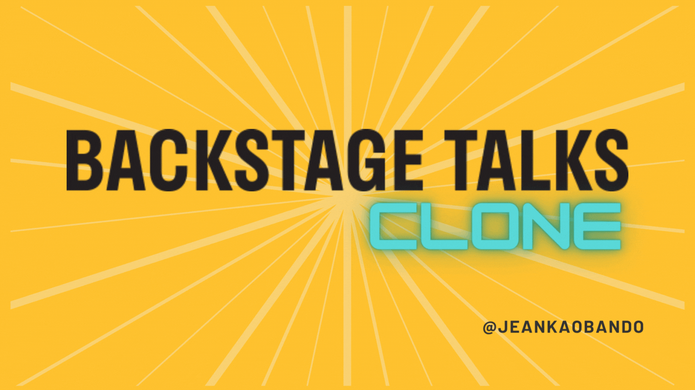

# Backstage Talks Clone

## Project Description

Backstage Talks Clone is part of the frontend challenge proposed by [Frontend Practice](https://www.frontendpractice.com/). Check out the challenge [here](https://www.frontendpractice.com/projects/backstage-talks). The purpose of this project is to implement a visually appealing slide catalog page using mainly "scroll-snapping" and "anchor-link" techniques.

## Table of Contents

- [Technologies Used](#technologies-used)
- [Features](#features)
- [Installation](#installation)
- [Usage](#usage)
- [Demo](#demo)
- [Screenshots](#screenshots)
- [Roadmap](#roadmap)
- [License](#license)
- [Contact](#contact)

## Technologies Used

- NextJS
- Typescript
- Styled Components
- Github actions
- AWS S3
- Conventional Commits 

## Features

- Use of scroll-snapping to implement Vertical Full Screen
- Implement the useTrackActiveSection to track active anchor link
- Add a HOC to prevent client-side features on server-side
- Allow rendering styled components on server-side
- Deployment to S3 bucket with Github Actions
- Add CSS Transitions to make changes between pages smooth

## Installation

1. Clone the repository: `git clone git@github.com:boceto1/backstage-talks-clone.git`
2. Navigate to the project directory: `cd backstage-talks-clone`
3. Install dependencies: `yarn install`

## Usage

1. Start the development server: `yarn dev`
2. Open your browser and visit `http://localhost:3000`

## Demo

Check out the live demo of Backstage Talks Clone [here](https://projects.jeankaobando.com/backstagetalks-clon)

## Screenshots

## Roadmap

- Implement a mobile-responsive design
- Add a manager to add a "n" numbers of catalog items
- Add a theme manager to change the colors and typography of slides

## License

This project is licensed under the [MIT License](LICENSE).

## Contact

For any questions or inquiries, feel free to reach out to me at janka.obando@outlook.es.
